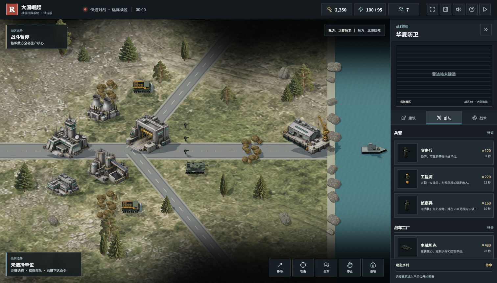
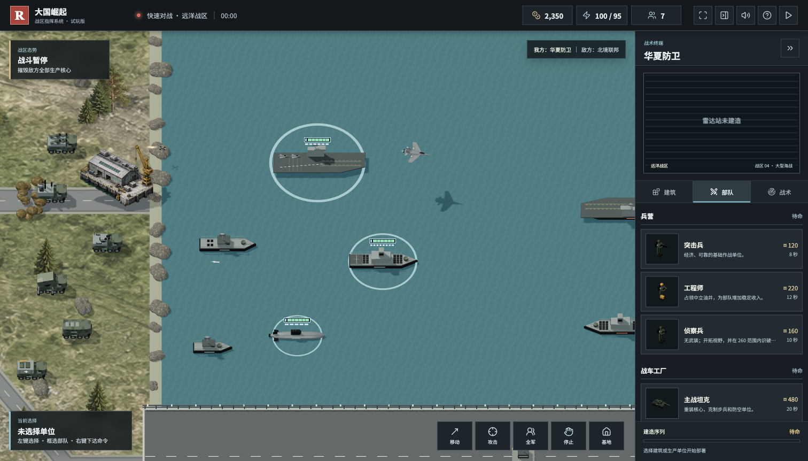

# 大国崛起

原创、非官方的红警风格浏览器即时战略游戏。使用 JavaScript、Three.js 和 Blender，提供五阵营、四张地图、单机 AI 遭遇战，以及陆海空与现代支援单位。不是《红色警戒》官方续作，也不是其代码或美术资源的移植。



[下载离线试玩包](https://github.com/chencheng666/great-powers-rts/releases/latest) · [掘金文章](docs/juejin-article.md) · [开发清单](ROADMAP.md) · [反馈问题](https://github.com/chencheng666/great-powers-rts/issues)

## 开始试玩

在 Releases 下载 ZIP，完整解压后用现代桌面浏览器打开 `PLAY.html`。无需安装 Node.js、Python 或 Blender；图像、模型与配乐内置。实时中文播报需要设备支持 Speech Synthesis 及中文音色，部分语音服务可能需要网络。手机文件预览器不一定支持网页游戏，推荐在电脑上试玩。

源码开发需要 Node.js 20.19+ 或 22.12+，以及支持 WebGL 2、开启硬件加速的现代浏览器：

```bash
git clone https://github.com/chencheng666/great-powers-rts.git
cd great-powers-rts
npm ci
npm run dev
```

```bash
npm test                 # 规则与展示逻辑测试
npm run build            # 常规网页构建
npm run package:offline  # 生成单文件 HTML 与 ZIP
```

## 已实现玩法

- 五个虚构阵营：华夏防卫、北境联邦、西陆同盟、东亚科技体、新月能源体，包含特色加成、单位和战略技能。
- 四张战场：灰谷地带、双桥裂谷、海峡前线、远洋战区。矿区、出生点及中立目标按双方方向镜像布置。
- 采矿、宝石、油井收入、供电、科技解锁、独立生产队列、取消返款、维修与出售。
- 兵营、战车工厂、兵工厂、空军基地、海军船坞分工明确。
- 双方独立战争迷雾，侦察、隐形无人机反隐、潜艇声呐探测，地形影响通行、视野和火力。
- 陆海空交战、框选、编队、攻击移动、全屏、可收起侧栏、小地图及触屏平移与缩放。
- 快速对战与全域歼灭两种胜利规则，新兵、标准、专家三档 AI。难度改变决策节奏与进攻规模，不额外赠送开局资金或修改单位属性。

## 现代陆战与海战



| 单位 | 用途与限制 |
| --- | --- |
| 巡飞弹发射车 | 根据友军侦察远程打击，有限弹药，巡飞弹可被干扰和拦截 |
| 电子干扰车 | 压制无人机和制导弹药，没有直接伤害，不能干扰无制导火箭 |
| 激光反无人机车 | 反无人机与巡飞弹，连续射击过热，不能攻击坦克或高空战机 |
| 远程火箭炮 | 展开后区域打击，有最小射程，需要侦察与补给 |
| 装甲运输车 | 搭载最多四名步兵或工程师，可在附近合法位置下车 |
| 维修补给车 | 停驻维修、补弹，消耗库存和资金，库存不足返回工厂 |
| 导弹驱逐舰 | 对舰、防空与反潜，具备声呐，导弹有飞行过程 |
| 航空母舰 | 最多同时出动三架可被击落的舰载机，返舰补给，损失需付费补充 |
| 攻击潜艇 | 潜航伏击舰艇，声呐可发现，发射后短暂暴露，不能攻击陆地 |

远洋战区为 3520 × 2240，大型舰艇在这张地图解锁。侦察提供目标，护卫保护远程火力，反制装备压制无人机，补给决定持续作战能力。这里的射程、价格与武器性能都是游戏平衡数值，不是现实军事参数。

## 操作

| 操作 | 控制方式 |
| --- | --- |
| 选择 / 框选 | 左键点击 / 拖动 |
| 移动 / 攻击 / 占领 | 选中单位后右键目标 |
| 攻击移动 / 停止 / 全军 | A / S / 空格 |
| 保存 / 选择编队 | Ctrl+1～9 / 1～9 |
| 平移 / 缩放 | 中键拖动、方向键、小地图 / 滚轮 |
| 返回基地 / 暂停 | H / Esc，全屏下 Esc 优先退出全屏 |
| 全屏 / 收起侧栏 | F / B，或顶栏对应按钮 |
| 乘车 / 下车 | 步兵右键友方运输车 / 选中运输车按 U |
| 音量 | 顶栏扬声器，可独立调节音乐、语音、音效 |

触屏支持单指平移、双指缩放，以及战场工具栏命令。

## 技术结构

| 模块 | 文件 |
| --- | --- |
| 单位、建筑、地图数据 | `src/data.js` |
| 经济、视野、战斗与 AI | `src/game.js` |
| 弹药、电子战、补给等现代规则 | `src/modern-combat.js` |
| Three.js 场景、动画、选取 | `src/render.js`、`src/visual-assets.js` |
| 建筑贴图锚点 | `src/architecture.js` |
| 编队避让、血条错位 | `src/unit-spacing.js`、`src/health-layout.js` |
| 音频及中文台词 | `src/audio.js`、`src/audio-data.js` |
| DOM 界面与交互 | `src/main.js`、`src/*.css` |
| Blender 资产生成 | `scripts/build_military_assets.py`、`scripts/build_modern_assets.py` |
| 离线交付 | `scripts/package-offline.mjs` |

原生 JavaScript ES Modules + Vite；渲染使用 Three.js 正交战术视角，寻路使用 PathFinding.js，图标使用 Lucide，音效使用 Web Audio，测试使用 Node.js 内置测试框架。建筑和植被为高清透明图集，移动单位为真实三维几何；这是一种混合渲染方案，不是全场景 PBR 写实游戏。

模型随仓库提供 GLB 和可编辑 `.blend`，无需安装 Blender 就能运行。重新生成模型时可使用本地 Blender 后台模式执行对应 Python 脚本。生成配乐可执行 `node scripts/generate-audio.mjs`。素材提示词与授权说明见 [ASSETS.md](ASSETS.md)。

`scripts/verify-*-browser.js` 是开发过程使用的 ego-browser 手动验证脚本，不是通用 CI 浏览器测试。需要游戏正在 `http://localhost:4173/` 运行、该工具及活动 TaskSpace，不能复用已经结束的空间。通过 `node scripts/run-browser-check.mjs audio 当前空间编号` 执行；`audio` 也可换为 `visual`、`battlefield` 或 `modern`，后者需先进入远洋战区对局。检查脚本不负责创建或结束 TaskSpace，应由调用方管理。

## 已知边界

目前是单机试玩版，没有多人联机、完整剧情战役或地图编辑器。阵营和武器仍需要真实玩家进行长期平衡验证；自动测试通过不代表竞技平衡已经完成。大规模单位寻路、低端设备帧率、海岸融合、建筑美术一致性与语音体验仍有提升空间。

欢迎通过 Issues 提交建议：地图、阵营、难度、复现步骤、截图和设备信息都很有帮助；也欢迎提交 PR。

## 开源与素材

作者提供部分按 [MIT](LICENSE) 开源；第三方授权见 [THIRD-PARTY-NOTICES.txt](THIRD-PARTY-NOTICES.txt)，AI 生成素材和音频的来源及权利范围见 [ASSETS.md](ASSETS.md)。公开版不包含早期 macOS 系统语音录音；勿将旧本地录音版 ZIP 作为公开开源包再分发。
