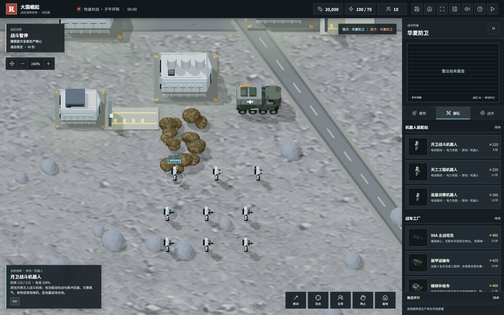
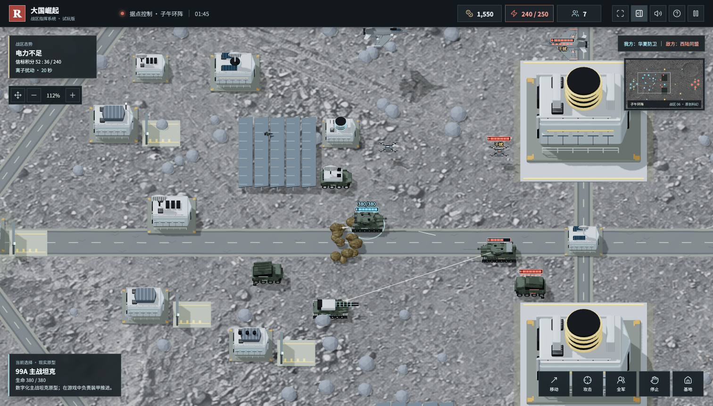

# 大国崛起

原创、非官方的红警风格浏览器即时战略游戏。使用 JavaScript、Three.js 和 Blender，提供五阵营、七张地图、单机 AI 遭遇战、昵称游客双人联机，以及陆海空与现代支援单位。不是《红色警戒》官方续作，也不是其代码或美术资源的移植。


[下载离线试玩包](https://github.com/chencheng666/great-powers-rts/releases/latest) · [掘金文章](docs/juejin-article.md) · [开发清单](ROADMAP.md) · [反馈问题](https://github.com/chencheng666/great-powers-rts/issues)

## 玩家反馈版 v0.7.0

根据 CAI、林及其他玩家反馈修复兵营／工厂维修、满弹主动整备、空闲靠站补弹，增加往返巡逻、右下卸载与补给、指令工具栏折叠、建造完成点击部署、矿车手动移动和回收。轰炸机飞临目标垂直投弹后返航，机场整备飞机可受地面攻击。

新增可反制的周期电子压制机、无桥“跨海登陆战”、月表专用原创飞行器；迷彩、防护网、敌我亮色标识、潜航外观、鱼雷尾迹、坡面姿态、海岸侧面和爆炸弹坑边缘同步优化。音色菜单可选已有系统中文音色或内置离线中文。

[反馈与取舍清单](docs/公众号玩家反馈整理-20261007.md) · [版本说明](docs/releases/v0.7.0.md) · [公众号文章](docs/wechat-feedback-20261007/公众号文章.md)

源代码：https://github.com/chencheng666/great-powers-rts

离线 ZIP：https://github.com/chencheng666/great-powers-rts/releases/download/v0.7.0/Great-Powers-RTS-v0.7.0.zip

v0.7.0 离线包仍为单机。最新源码已包含双人联机；公网测试入口为 http://43.135.186.21:8088/ 。该服务器位于硅谷，国内下载站尚未上线；最新房间加入修复和部分三维改进待服务器发布。

## 双人联机与局域网

公网测试采用昵称游客、六位房间码、双方准备后房主开战。目前只有双人房间，没有微信登录、天梯或正式服务承诺。最新版源码包含回车加入、房间码规范化、连接等待与大厅错误提示修复。

局域网主机使用完整源码与 Node.js 22.16+：

```bash
npm ci
npm run build
npm run server:lan
```

其他玩家在浏览器打开启动日志中的局域网 IP 地址，不需要安装 Node.js。离线 `PLAY.html` 本身不含对战服务；两名玩家需不同设备或独立浏览器身份。仅对可信局域网开放对应端口。

[联机部署说明](docs/联网对战与部署说明.md) · [加入修复与局域网指南](docs/联网加入修复与局域网指南-20261008.md)

## 持续反馈修复（本地开发版，尚未发布）

继续核对公众号留言与私信，采纳 CAI 的航班积压、港口比例、舰船涂装、弹坑和建筑风格反馈：后勤运输机分离等待、串行交付及错开返航航线；原创三维长码头匹配货船，舰船改海军灰，机场等四类设施恢复三维结构与细节；弹坑改不规则贴地焦痕与碎石，取消圆环土壁。原“全域屏障”明确为“协同电子防护”，与独立网络攻击分开，实际链路干扰期间小地图显示雪花屏并在反制后恢复。

改动保留双方经济和战斗规则，不扩大港口维修范围，不将弹坑作为额外障碍。外交事件、三方同盟与背叛先记入规划。当前源码包含这些改动，但上方 v0.7.0 公开下载包尚未更新。

[下载与试玩指引](docs/下载与试玩指引.md)

人物与装备继续细化：突击兵、工程师、间谍重制身体比例、弯臂持枪、膝关节、头盔、携行具与工具箱；坦克采用中空弧形履带和分节履带板，追加炮口、轮轴及观瞄细节；常规战机与支援车辆补充喷口、座舱框和机械结构。保留模型纹理坐标，加入原创程序化涂层、织物与橡胶的颜色、法线和粗糙度贴图，图鉴增加环境反射。无需部署 AI 建模工具；仍是原创游戏化模型，不是现实装备精确复刻，也未改战斗数值。

## 玩家荣誉与称号

本地开发版新增八阶玩家称号与原创金属徽章。首页点击当前称号、战场点击左上徽章，可打开荣誉档案，查看晋升进度、战区功勋、最近 12 场胜利及积分规则。打开档案会暂停当前战局，关闭后恢复打开前的暂停状态。

| 等级 | 称号 | 累计积分 | 累计胜场 |
| --- | --- | --- | --- |
| 1 | 预备指挥官 | 0 | 0 |
| 2 | 前线新锐 | 100 | 1 |
| 3 | 装甲先锋 | 400 | 3 |
| 4 | 战术专家 | 1000 | 6 |
| 5 | 战区统帅 | 2000 | 10 |
| 6 | 王牌指挥官 | 3600 | 18 |
| 7 | 战略大师 | 6000 | 28 |
| 8 | 传奇元帅 | 9500 | 45 |

晋升须同时满足积分、胜场两个门槛。每场胜利按新兵／标准／专家难度获得 **100／160／240 分**；全域歼灭另加 20 分，据点控制另加 30 分。首胜 +80、首次战胜专家 +60、首次海域获胜 +40、首次子午获胜 +40；使用全部五阵营获胜 +100、在全部七张地图获胜 +150。累计 5／10／25／50／100 胜，分别获得一次性 100／150／250／400／600 分功勋奖励。

胜利结算展示本场加分明细、功勋解锁、晋升授勋、下一阶双进度及原创音效；失败、平局不扣分、不降级。称号不会增加攻击、生命、收入或其他战力，不影响双方公平性。已达到最高称号后，胜场和积分仍会增长。

新版本战局编号随存档保留，同一战局只结算一次，重读存档不会重复领分。旧存档按原文件指纹识别，不同旧快照无法可靠关联；载入后重新保存会固定编号。本机荣誉不是防篡改的联网竞技排名。

荣誉与战局存档分开保存，更新离线包、换电脑或清理浏览器前，在荣誉档案右上角导出 JSON 备份。导入后需确认替换，**不会合并积分**；荣誉备份不能从主界面的战局导入口载入。存储失败会保留原有记录并提示重试，不会显示已领取未保存的积分。上述功能尚未发布到 GitHub Release。

## 画面与首页升级 v0.6.0

核心基地设施改用立体模型，细化五阵营坦克和两类飞机，共 17 个模型模板；兵工厂与战车工厂外观分开。装甲接缝、观瞄、工业通风、检修走道、航空挂架与材质磨损增加细节，其他单位和设施继续逐步升级。

常规地图换用小尺度地表材质，月壤重复密度、平滑岩石与道路磨损同步调整。增加轻微三维地表起伏，基地及主路保持平整；起伏只影响视觉，不增加隐含的寻路或伤害规则。

枪口短闪、短段曳光、连续能量束、重力散射碎片、分层烟尘、地面焦痕和海面冲击各自表现。新首页采用全幅原创主视觉与底部作战部署区，继续战局、导入、三类胜利规则及所有地图保留。首页插画与实际游戏画质分开标注。


[v0.6.0 下载](https://github.com/chencheng666/great-powers-rts/releases/tag/v0.6.0) · [实机截图与更新说明](docs/releases/v0.6.0.md)

## 月表机器人版 v0.5.0

子午环阵的三类步兵改为原创无人机体：**月卫战斗机器人、天工工程机器人、巡星侦察机器人**。新增独立 Blender 模型、机械步态和电池状态；兵营改称机器人装配站，常规地图仍保留真人士兵。

机器人不需要氧气与食物，机动、待机和脉冲武器消耗电池，25% 以下自动返场。装配站和电站可充电，补给车可以主动救援停机机器人；充电依赖电网，每个充电机体增加 4 电力负载。缺电停产、停充，但不会清空已有电池。机体维修仍消耗资金，双方规则一致，价格与原作战职责保留。



[v0.5.0 下载](https://github.com/chencheng666/great-powers-rts/releases/tag/v0.5.0) · [更新说明与模型图](docs/releases/v0.5.0.md)

选中机器人按 **R** 或点击电池图标返回充电维修。电量耗尽时停机且不再提供侦察／反隐，需补给车接近救援。新存档保存精确电量；旧子午存档读入时原三类步兵转换为满电机器人，其他战局状态保留。升级前建议导出存档备份。

## 港口与后勤战争版 v0.4.0

2026 年 10 月 6 日，根据 CAI 及其他试玩玩家的建议升级：全部舰艇和潜艇可以回己方港口付费维修、补弹；常规地图取消矿区和矿车，改为可被拦截的运输机、集装箱船提供收入，油井争夺保留。子午环阵继续就地采矿。

新增后勤中心、运输机、集装箱船、华夏 052D 驱逐舰原创简化模型，细化航母甲板与舰岛。大型海图可生产舰载制空机和舰载攻击机，实际飞机登舰、起飞、返舰维修补弹；舰载机编组与原有抽象舰载机模式互斥，不重复计算火力。雷达与实验室解锁付费、限时、带冷却的侦察卫星，空战转弯及导弹俯仰同步改进。

[v0.4.0 下载](https://github.com/chencheng666/great-powers-rts/releases/tag/v0.4.0) · [更新说明](docs/releases/v0.4.0.md) · [图文文章](docs/wechat-fleet-20261006/公众号文章.md) · [玩家建议验收清单](docs/玩家建议验收清单.md)

下载 `Great-Powers-RTS-v0.4.0.zip`，完整解压后打开 `PLAY.html`。选中舰艇按 **R** 回港整备；舰载机右键己方航母登舰，选中航母按 **U** 起飞。维修消耗资金，断电、遭受攻击或移动时不能整备。旧存档维持旧采矿经济以保护现有战局，体验运输经济需重新开局。

运输机每 36 秒一班，后勤中心卸货到账 720；海图集装箱船每 60 秒一班，港口卸货到账 900。摧毁途中运输会截断这一班收入；失去后勤中心时指挥部只提供每班 180 的应急空运。卸货需要供电和安全时间；增加相同设施不叠加班次。双方适用相同规则。

## 上一版 v0.3.0

2026 年 10 月 6 日更新：飞机返场付费维修与补弹，步兵、坦克、防空车等有限弹药，补给车自动寻找友军步兵与载具。新增坦克登陆舰、远程轰炸机、重型运输机及独立 Blender 模型；无人机可以直接飞越海面，不再绕桥。

本版同时公开此前本地完成的存档、返回主界面、受袭定位警报与画质改进。本地新版提供内置中文男声、女声各 67 条播报，断网可用，声音偏机械，不是专业真人配音。

## CAI 建议：纵深与情报战（本地开发版）

- 七张地图新开局默认启用纵深尺寸：宽、高各为原版 1.5 倍，面积 2.25 倍；取消首页勾选可用标准尺寸。旧存档保持原尺寸和经济，不强行改地图。
- 每张新地图增加镜像的物资箱、设备回收场和能源仓。地面单位右键物资箱回收；工程师、矿车、补给车可回收设备；工程师占领能源仓后提供 40 电力、前哨视野与扩建范围，有电时按每秒 8 资金交付有限库存。敌方可夺回，但库存不会重置。
- 间谍采用黑西装、墨镜、公文包模型，无武装，保留侦察与反隐；右键可见敌方建筑一次性潜入，45 秒定时破坏。工程师右键己方被潜入建筑，停驻 3 秒拆弹；被攻击会暂时中断，拆弹不消耗工程师。子午图仍用侦察机器人执行该任务。
- 战略武器站提供游戏内网络战：有电、充能 120 秒、支付 500 资金，预警 12 秒后干扰对手新指令 4 秒。既有行军、生产和自动还击继续，镜头、暂停及存档可用；摧毁源站或断电解除。双方规则一致，不是实际网络入侵或多人联机。
- 建筑完工仍等待点击菜单才进入部署，右键或 Esc 退出不丢成品；改进移动前车绕行和窄桥寻路，选中部队显示实际路线虚线与目的地。
- 重制常规步兵、工程师、间谍的比例、装备与步态，资源站增加实体模型；新增设施名称潜入／拆弹播报和内置女声。

细节见 [CAI 建议采纳说明](docs/CAI建议采纳说明.md)。以上为本地开发版内容，发布版下载链接不代表这些改动已上传。

[v0.3.0 下载与更新说明](https://github.com/chencheng666/great-powers-rts/releases/tag/v0.3.0) · [本轮公众号文章](docs/wechat-logistics-20261006/公众号文章.md) · [国产系统适配计划](docs/国产系统适配与上架计划.md)

下载 `Great-Powers-RTS-v0.3.0.zip` 后完整解压，打开 `PLAY.html`。Linux 包含可选的启动和用户应用菜单安装脚本；这仍是浏览器游戏，不是已审核上架的麒麟原生应用。

## 上一版 v0.2.0

本版增加纵深战区与子午环阵、现实装备资料与独立简化模型、据点控制玩法、敌我识别、无人机动画、建筑信息浮窗与设施出口，并改进采矿车避障和交战反馈。仍为单机，联机与东风、052D 专属模型等内容属于后续规划。

[v0.2.0 更新说明与下载](https://github.com/chencheng666/great-powers-rts/releases/tag/v0.2.0) · [国庆升级图文](docs/wechat-national-day-20261002/article.html) · [发布记录](docs/releases/v0.2.0.md)

下载 `Great-Powers-RTS-v0.2.0.zip` 后完整解压，打开包内 `PLAY.html` 即可试玩。源码可通过本仓库或 Release 页的 Source code 下载；不要把公众号图文素材包当成游戏包。

## 存档、主界面与战场反馈

新增手动存档、每 45 秒自动存档、存档文件导入导出，以及主界面的继续战局入口。手动与自动存档分开；资源、队列、单位命令、运输乘员、飞行中弹药、迷雾、AI 进度和镜头均可恢复。读档后保持暂停，点击继续作战再推进。

顶部保存图标可直接保存；房屋图标和暂停菜单可返回首次主界面，退出前询问是否保存。后台切换自动保存并暂停。存档保存在当前浏览器，不会自动上传服务器；无痕模式、清理浏览器数据、切换浏览器或更换离线文件位置可能使本地存档不可用，跨设备或升级前请导出 JSON 文件备份。本地空间不足或文件不兼容会提示，不会静默丢失当前战局。

我方部队与基地受到敌方伤害时分别播报中文警报，并显示可点击定位的受袭面板、单位红色角标、短暂边缘警示和小地图脉冲。播报采用全局限频，基地报警可升级优先级；敌军受击不触发我方警报。

画面增加低分辨率环境遮蔽、镜头范围内的精细阴影、地表微凹凸与航天材质细节；月壤换为细颗粒纹理，保留旧素材。暂停菜单可选择精细或流畅画质。这些改进已纳入 v0.3.0。

## 开始试玩

在 Releases 下载 ZIP，完整解压后用现代桌面浏览器打开 `PLAY.html`。无需安装 Node.js、Python 或 Blender；图像、模型、配乐与中文兜底播报内置。优先使用设备的中文 Speech Synthesis，缺少音色或播报失败时改用内置 WAV。主要面向桌面电脑。

完整源码开发与对战服务需要 Node.js 22.16+，以及支持 WebGL 2、开启硬件加速的现代浏览器：

```bash
git clone https://github.com/chencheng666/great-powers-rts.git
cd great-powers-rts
npm ci
npm run dev
```

```bash
npm test                 # 规则与展示逻辑测试
npm run build            # 常规网页构建
npm run package:offline  # 生成单文件 HTML 与 ZIP
```

## 已实现玩法

- 五个虚构阵营：华夏防卫、北境联邦、西陆同盟、东亚科技体、新月能源体，包含特色加成、单位和战略技能。
- 六张战场：灰谷地带、双桥裂谷、海峡前线、远洋战区、纵深战区、原创科幻战区子午环阵。纵深战区为 4480 × 2880，面积为灰谷地带四倍；基地、后勤入场、中立目标及月表矿区按双方方向镜像布置。
- 阵营装备资料层：99A、T-90MS、M1A2、K2、Merkava Mk.4，以及各阵营火箭炮与部分航空装备的名称、原型定位；五种坦克和五种火箭炮有独立原创简化模型。没有对应公开型号的单位仍明确标记为通用或原创概念，不冒充现役。来源和模型精度边界见 [装备档案](EQUIPMENT.md)。
- 装甲迎敌方向影响坦克与电磁炮伤害；科幻地图光伏维护区为步兵提供掩护，区域打击与重穿透火力不被减免。炮口闪光、后坐、动态短曳光、碎屑、冲击波和导弹烟迹增强交战反馈。
- 常规战区运输经济、月表采矿与宝石、油井收入、供电、科技解锁、独立生产队列、取消返款、维修与出售。
- 兵营、战车工厂、兵工厂、空军基地、海军船坞分工明确。
- 建筑悬浮信息、生命与电力状态、实际生产进度；设施出口、卷帘门、步兵行走与出厂后集结。采矿车提前避让前方车辆、保持矿区目标，并在矿区拥挤时分流。
- 我方蓝青、敌方红色的机体标识、血条、目标圈与雷达标记；雷达方形／菱形辅助区分。低血量保留敌我色，单独显示危急边框；满血可见敌军也显示血条，悬停可看生命数值，另有干扰、瘫痪与补给状态。
- 支持选择相同阵营进行镜像对战，换阵营时保留对手选择；小屏横向开局面板可滚动，不再挤掉阵营列表。
- 攻击无人机、隐形飞翼侦察机、六旋翼蜂群母机重新建模，增加碳纤维机臂、载荷舱、光电吊舱与通信设备。旋翼独立转动，侦察与攻击无人机飞行时平滑倾斜，暂停时悬浮及旋翼停止。
- 双方独立战争迷雾，侦察、隐形无人机反隐、潜艇声呐探测，地形影响通行、视野和火力。
- 陆海空交战、框选、编队、攻击移动、全屏、可收起侧栏、小地图及触屏平移与缩放。
- 快速对战、全域歼灭、据点控制三种胜利规则，新兵、标准、专家三档 AI。据点模式每座己方信标每秒积累 1 分，240 分获胜，也可摧毁敌方生产核心；同帧双方达标判平局。难度改变决策节奏与进攻规模，不额外赠送开局资金或修改单位属性。

## 子午环阵



上图来自浏览器真实渲染的固定验收场景，展示三维设施和交火，不是预渲染宣传图，也不代表自然对局的单位排列。

3200 × 2080 的原创月表科幻战区，具有独立地表纹理、完整三维基地、中央反应堆障碍、光伏维护掩体和三处可争夺信标。信标额外提供 40 电力。不是官方南天门项目或子午工程的授权改编，设定来源和现实边界见 [装备档案](EQUIPMENT.md)。

三种地图限定装备：凌霄电磁炮车（展开、最小射程、有限弹药、不能对空）、云隼无人制空机（不能对地、需返场补弹）、子午通信中继车（无武装、260 范围内保障己方通信）。双方按同样条件解锁与生产。

离子扰动以 180 秒周期发生：第 80 秒预警，第 100～125 秒扰动。没有己方中继车或已占领信标保障的空军受干扰，巡飞弹、导弹和舰载机也受影响；无制导火箭与地面炮弹不受影响。通信保障不能抵消敌方电子干扰车。资源井沿用原有经济规则，不宣称月球现实存在油井。

## 现代陆战与海战


| 单位 | 用途与限制 |
| --- | --- |
| 巡飞弹发射车 | 根据友军侦察远程打击，有限弹药，巡飞弹可被干扰和拦截 |
| 电子干扰车 | 压制无人机和制导弹药，没有直接伤害，不能干扰无制导火箭 |
| 激光反无人机车 | 反无人机与巡飞弹，连续射击过热，不能攻击坦克或高空战机 |
| 远程火箭炮 | 展开后区域打击，有最小射程，需要侦察与补给 |
| 装甲运输车 | 搭载最多四名步兵或工程师，可在附近合法位置下车 |
| 维修补给车 | 自动寻找可达友军步兵与陆地载具，治疗、维修、补弹，库存不足回厂；手动移动优先 |
| 导弹驱逐舰 | 对舰、防空与反潜，具备声呐，导弹有飞行过程 |
| 航空母舰 | 可分配三架玩家生产的适配舰载机，甲板起降、付费维修补弹；没有实际编组时沿用内置舰载机模式，二者互斥 |
| 舰载制空机 / 舰载攻击机 | 大型海图实验室解锁；分别对空 / 对地对舰，有限弹药，可在航母或空军基地整备；采用通用模型，不将歼-20 冒充舰载机 |
| 攻击潜艇 | 潜航伏击舰艇，声呐可发现，发射后短暂暴露，不能攻击陆地 |
| 坦克登陆舰 | 大型海图生产；12 格载重，靠岸装卸，步兵 1 格、车辆 4 格，不能深海卸载 |
| 远程轰炸机 | 实验室解锁；4 枚有限炸弹，有飞行时间和范围伤害，无法空战或反潜 |
| 重型运输机 | 雷达解锁；8 格混合载重，在安全陆地停驻装卸，不能空投坦克 |

远洋战区为 3520 × 2240，大型舰艇在这张地图解锁。侦察提供目标，护卫保护远程火力，反制装备压制无人机，补给决定持续作战能力。这里的射程、价格与武器性能都是游戏平衡数值，不是现实军事参数。

## 操作

首页“装备图鉴”、对局顶部书本图标，以及选中单位或建筑后的书本按钮，都可进入图鉴。45 类装备、人物／机器人和设施支持分类、型号搜索、阵营与战区切换、三维模型旋转与缩放。资料包括游戏数值、用途、弱点、生产前置、解锁关系与补给规则。

“仅当前可用”按所选阵营和战区筛选，并不代表当前对局已拥有全部科技、资金或电力。现实原型、通用单位与原创科幻装备分别标注，数值不是现实军事参数。查看图鉴会暂停战局，关闭后保留此前的暂停状态，不修改实际阵营或地图。

| 操作 | 控制方式 |
| --- | --- |
| 选择 / 框选 | 左键点击 / 拖动 |
| 移动 / 攻击 / 占领 | 选中单位后右键目标 |
| 攻击移动 / 停止 / 全军 | A / S / 空格 |
| 保存 / 选择编队 | Ctrl+1～9 / 1～9 |
| 平移 / 缩放 | 右键或中键拖动、方向键、小地图 / 滚轮或镜头按钮 |
| 拖拽地图模式 | M 或左上角移动图标，开启后左键拖拽 |
| 建筑信息 / 集结点 | 点击建筑 / 选中生产设施后右键地面，或浮窗旗帜按钮 |
| 返回基地 / 暂停 | H / Esc，全屏下 Esc 优先退出全屏 |
| 全屏 / 收起侧栏 | F / B，或顶栏对应按钮 |
| 装载 / 卸载 | 步兵、坦克右键友方适配运输单位 / 选中运输单位按 U |
| 主动返场 / 回港整备 | 选中单位按 R 或油料图标；补给车扫描图标切换自动保障 |
| 舰载机登舰 / 起飞 | 适配舰载机右键己方航母 / 航母按 U；停舰后才能起降 |
| 音量 | 顶栏扬声器，可独立调节音乐、语音、音效 |

触屏支持单指平移、双指缩放，以及战场工具栏命令。

## 技术结构

| 模块 | 文件 |
| --- | --- |
| 单位、建筑、地图数据 | `src/data.js` |
| 经济、视野、战斗与 AI | `src/game.js` |
| 运输班次、卸货经济与侦察卫星 | `src/logistics-economy.js` |
| 弹道高度、俯仰与转弯限制 | `src/projectile-flight.js` |
| 弹药、电子战、补给等现代规则 | `src/modern-combat.js` |
| 装备原型、模型映射与方向装甲、掩体、扰动 | `src/equipment.js`、`src/tactical-rules.js` |
| Three.js 场景、动画、选取 | `src/render.js`、`src/visual-assets.js` |
| 建筑贴图锚点 | `src/architecture.js` |
| 建筑信息、设施出口与浮窗布局 | `src/battlefield-details.js` |
| 编队避让、血条错位 | `src/unit-spacing.js`、`src/health-layout.js` |
| 敌我关系色与血条状态 | `src/team-visuals.js` |
| 音频及中文台词 | `src/audio.js`、`src/audio-data.js` |
| DOM 界面与交互 | `src/main.js`、`src/*.css` |
| Blender 资产生成 | `scripts/build_military_assets.py`、`scripts/build_modern_assets.py`、`scripts/build_drone_assets.py`、`scripts/build_equipment_assets.py` |
| 离线交付 | `scripts/package-offline.mjs` |

原生 JavaScript ES Modules + Vite；渲染使用 Three.js 正交战术视角，寻路使用 PathFinding.js，图标使用 Lucide，音效使用 Web Audio，测试使用 Node.js 内置测试框架。现实战区建筑和植被为高清透明图集，移动单位与科幻基地为三维几何；这是一种混合渲染方案，不是全场景电影级写实游戏。

模型随仓库提供 GLB 和可编辑 `.blend`，无需安装 Blender 就能运行。重新生成模型时可使用本地 Blender 后台模式执行对应 Python 脚本。生成配乐可执行 `node scripts/generate-audio.mjs`。素材提示词与授权说明见 [ASSETS.md](ASSETS.md)。

`node scripts/run-browser-check.mjs future 当前空间编号` 验证子午环阵的完整三维设施、原型名称、未来装备、交战特效与桌面／手机竖屏／横屏画布。其余验证方式同下文。

`scripts/verify-*-browser.js` 是开发过程使用的 ego-browser 手动验证脚本，不是通用 CI 浏览器测试。需要游戏正在 `http://localhost:4173/` 运行、该工具及活动 TaskSpace，不能复用已经结束的空间。通过 `node scripts/run-browser-check.mjs audio 当前空间编号` 执行；`audio` 也可换为 `visual`、`battlefield`、`details`、`teams`、`catalog` 或 `modern`，后者需先进入远洋战区对局。`details` 验证建筑浮窗、出厂动画、地图拖拽与移动端布局；`teams` 验证同阵营敌我配色、实际血条／雷达像素、迷雾隐藏、无人机动画及三种视口。`catalog` 验证图鉴搜索、跳转、暂停恢复、三种桌面视口及全部模型的渲染和取景。检查脚本不负责创建或结束 TaskSpace，应由调用方管理。

## 已知边界

目前是单机试玩版，没有多人联机、完整剧情战役或地图编辑器。[联机方案](MULTIPLAYER.md)推荐先实现双人局域网，再复用同一套权威服务端支持公网；当前共享开发网址不等于联机。阵营和武器仍需要真实玩家进行长期平衡验证；自动测试通过不代表竞技平衡已经完成。大规模单位寻路、低端设备帧率、海岸融合、建筑美术一致性与语音体验仍有提升空间。

欢迎通过 Issues 提交建议：地图、阵营、难度、复现步骤、截图和设备信息都很有帮助；也欢迎提交 PR。

## 开源与素材

作者提供部分按 [MIT](LICENSE) 开源；第三方授权见 [THIRD-PARTY-NOTICES.txt](THIRD-PARTY-NOTICES.txt)，AI 生成素材和音频的来源及权利范围见 [ASSETS.md](ASSETS.md)。公开版不包含早期 macOS 系统语音录音；勿将旧本地录音版 ZIP 作为公开开源包再分发。
# 联网对战

新增昵称游客双人对战，六位房间码邀请、双方准备、服务器战斗判定、断线重连和独立战绩。微信扫码登录后续接入。本机单机存档与荣誉仍独立保留。

本地先 `npm run build`，再 `npm run server`，访问 `http://127.0.0.1:4180/`。开发代理、容量限制、掉线判定和部署维护见 [联网对战与部署说明](docs/联网对战与部署说明.md)。
