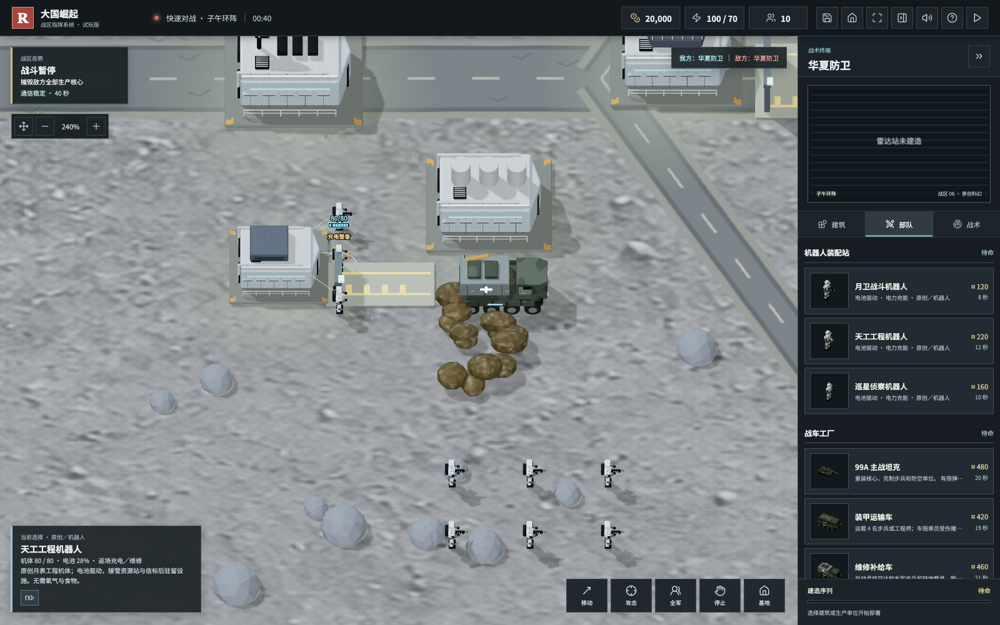
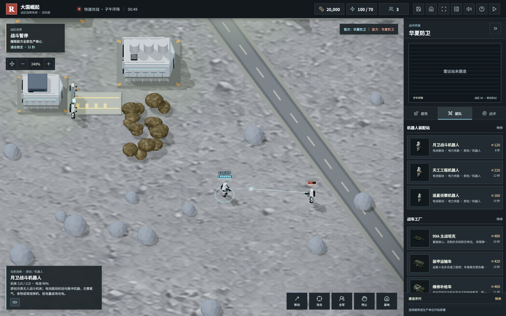

# v0.5.0 月表机器人版

2026-10-06，根据玩家“子午地图更适合机器人，只需要电力”的建议，把月表步兵变成真正受能源约束的无人机体。常规地图不转换。

## 三类机体

| 机体 | 原职责 | 模型细节 |
| --- | --- | --- |
| 月卫战斗机器人 | 基础对地作战 | 陶瓷装甲、光电头部、脉冲电容武器、电池背包 |
| 天工工程机器人 | 占领油井与信标，接管后驻留 | 工程夹爪、工具模块与通信终端 |
| 巡星侦察机器人 | 无武装侦察与反隐 | 多光谱镜头、扫描光电球与传感器桅杆 |

三类机体共享密封机械结构、髋膝关节和左右腿动画，不沿用真人皮肤或作战服。兵营在此图改称“机器人装配站”。原生产费用、生命、移动速度和克制职责保留，双方使用同一规则。

## 电力保障

- 电池容量 100%，25% 以下自动返场并保留原任务；按 R 或点击电池按钮也可主动返场。
- 待机每秒消耗 0.08%，移动每秒消耗 0.22%，战斗型一次脉冲攻击消耗 4%。不再使用常规步枪弹药。
- 装配站、电站提供充电与付费机体维修。补给车可以自动接近停机机器人，提供充电中继和原有库存维修。
- 充电每秒恢复 12%，每个连接机体占用 4 电力负载；必须停稳、脱离近期攻击且电网供电正常。补给车需有至少 8 库存作为可用保障条件，充电本身不扣库存，机体维修仍扣库存／资金。
- 缺电阻止充电和机器人生产，但不直接清空现有电池；电池耗尽后停止行动、侦察与反隐，只能等待补给车救援。
- 充满后恢复原任务。维修需资金，没钱时不会免费修复机体；已满血机体即使零资金仍可充电。

## 源模型展示

以下由随仓库 `.blend` 源文件摄影棚渲染，不是游戏截图，也不是尚未实现的概念图。

## 存档与验收

新存档保存精确电量与充电任务。没有电池字段的旧子午存档，将三类步兵迁移为满电机器人并移除旧步枪弹药状态；其他地图、资源和任务保留。升级前请导出存档备份。

150 项自动测试通过，包括 11 项新增机器人用例；桌面实机验收模型和机械步态、耗电、手动与自动充电、电力负载、存档以及 1600 × 1000 和 1280 × 800 画布非空、WebGL 错误与界面溢出。截图是按实际规则布置的功能场景，不是自然对局战报。

26.64 MB 单文件离线试玩 ZIP 在断网状态下打开验收：月表机体电池与采矿保留，读档恢复 17.35% 精确电量及充电任务，没有外部资源请求或 WebGL 错误。模拟没有中文系统音色时，内置 WAV 与配乐实际解码播放；未替代国产系统实机认证。

## 内容边界

这是原创月表科幻设定，借鉴空天与无人系统题材，不使用南天门 IP 官方装备名称或模型，不声称现实已服役或官方授权。能源与保障数值为游戏规则，不是月面工程仿真；低重力、真空散热、完整月面物流、联网、东风及核规则仍未全部实现。

下载 [Great-Powers-RTS-v0.5.0.zip](https://github.com/chencheng666/great-powers-rts/releases/tag/v0.5.0)，完整解压并打开 `PLAY.html`，选择“子午环阵”。欢迎提供地图、阵营、时间、设备与复现步骤，共同完善玩法。
