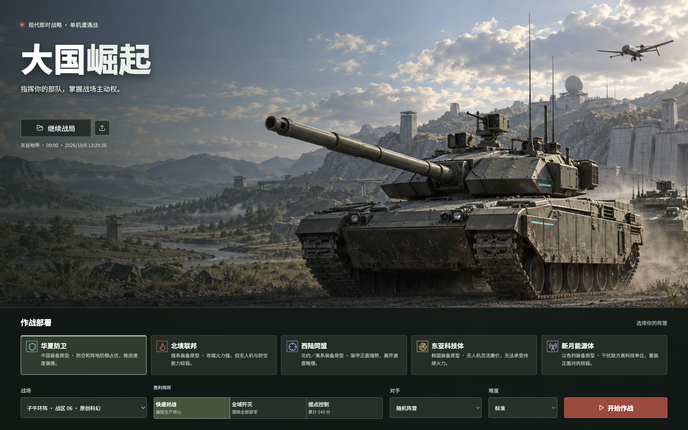
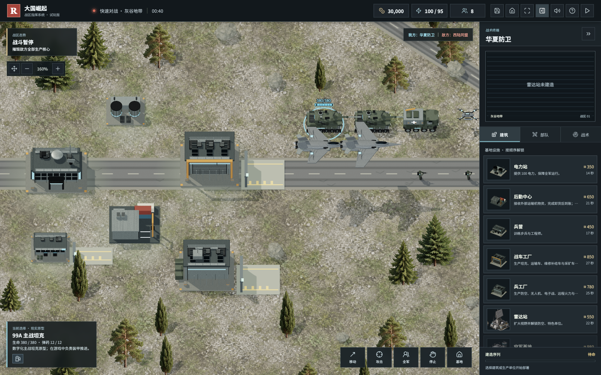
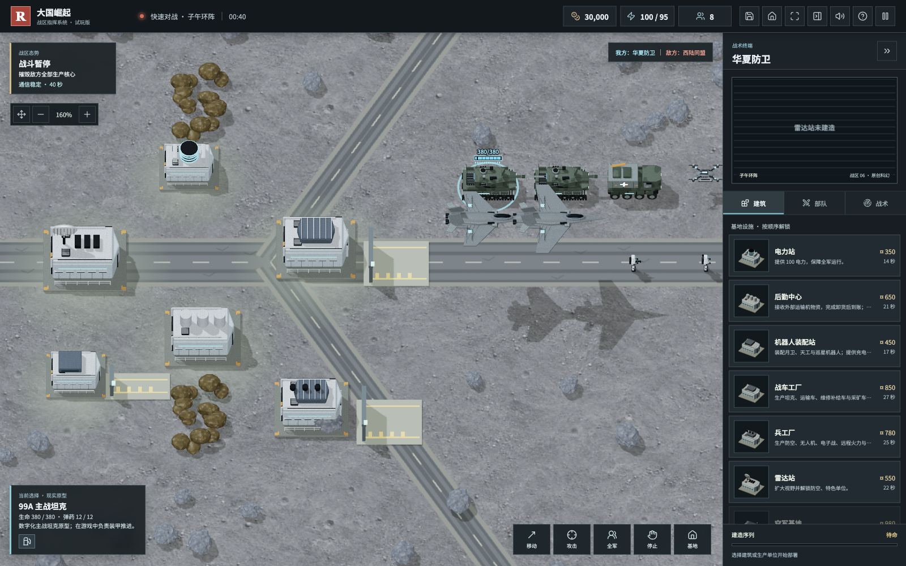
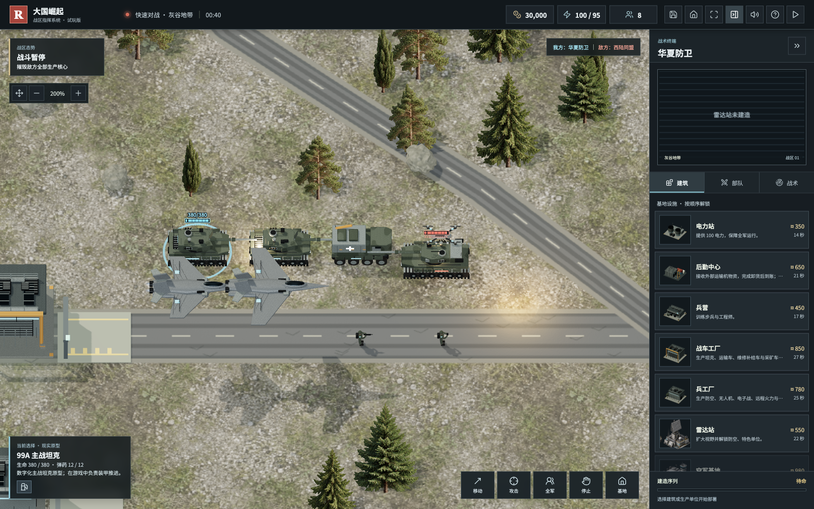
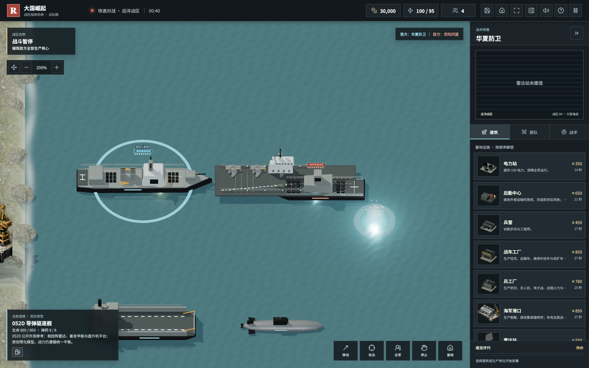

# v0.6.0：画面与首页升级

2026 年 10 月 6 日。本轮聚焦桌面画面与作战首页，不改变单位成本、生命、弹药、伤害和克制规则。

## 新首页

全幅原创军事插画，阵营、地图、对手、难度和胜利规则集中在底部。继续战局和导入入口保留。以下是实际首页截图，背景插画不是实机战场。

## 模型与地表

五类常规设施改用可投射阴影的三维模型；兵工厂与战车工厂分别保留精密装配设备和大型车间吊架。细化五类月表设施、五阵营坦克、制空机和攻击机，共 17 个覆盖模板。

增加检修护栏、配电设备、屋顶采光、装甲紧固件、牵引索、观瞄、襟翼接缝与武器挂架。`.blend`、GLB 和生成脚本均公开，模型仍为原创简化游戏模型，不是现实厂商精确网格。

地表采用新小尺度材质，月壤纹理重复密度调整，岩石改为更平滑的不规则形体。地面增加轻微可视起伏，基地和主路平整；它不产生额外碰撞、掩体加成或伤害差异。

## 交火表现

动能武器使用短段曳光和快速熄灭的枪口火光，能量武器保留连续光束。命中分为火星、烟尘和水面效果；爆炸增加短促高亮、分层烟团、受重力影响的散射碎片、冲击尘环与地表焦痕。导弹与火箭沿用已有飞行轨迹规则。

动态闪光灯固定为 4 盏，焦痕池最多 80 个，并随时间回收；迷雾隐藏特效，暂停不会推进其生命周期。保留精细／流畅画质切换。

## 验收与范围

- 155 项自动测试通过，包含地形高度、曳光、特效配置和新 GLB 模板检查。
- 桌面首页在 1600 × 1000、1280 × 800、1024 × 768 检查无裁切与横向溢出。
- 陆地、月表、海图实机像素检查通过，无 WebGL 错误；碎片动画、特效回收、重复返回菜单和画质切换通过。
- 完整离线包使用 `PLAY.html`；图像、模型和声音全部内置。

本轮没有重建全部兵种和所有建筑，也没有实现联网、东风系列或核武器。仍是单机 RTS，现有后勤、机器人、港口整备、有限弹药和存档继续保留。

首页与地表图片由内置 `image_gen.imagegen` 生成，完整提示词见 `assets/asset-prompts.json`；旧素材保留。模型使用本地 Blender 程序生成，授权边界见 `ASSETS.md`。

[下载 v0.6.0](https://github.com/chencheng666/great-powers-rts/releases/tag/v0.6.0) · [提交试玩反馈](https://github.com/chencheng666/great-powers-rts/issues)
