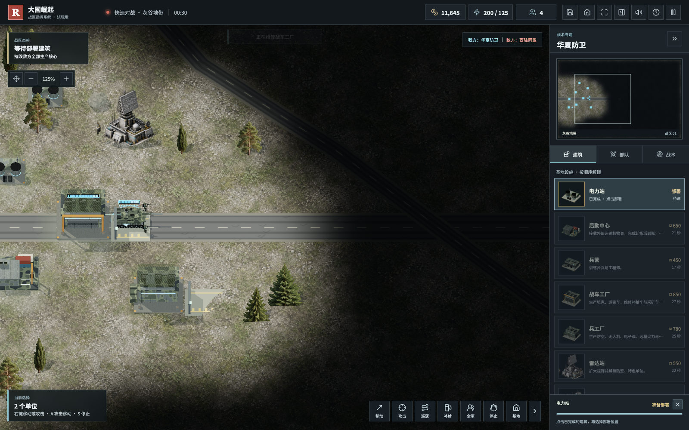
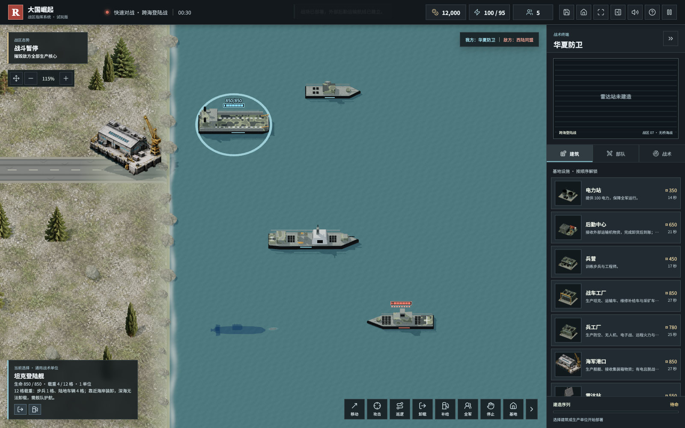
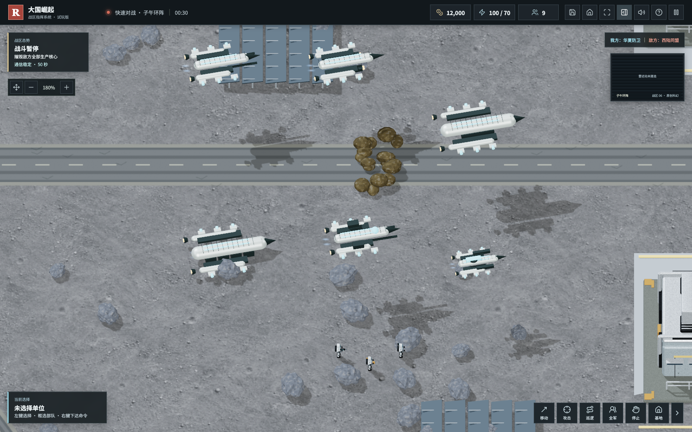

# v0.7.0：玩家反馈共建版

2026 年 10 月 7 日。感谢 CAI 的持续试玩和具体复现，感谢林、丫、星空的天马、萬泉、W、Sam™、春风不语等读者的建议与支持。反馈来源为游戏文章留言及后台可见最近 30 天私信；不公开私信原文或后台数据。

## 后勤与操作修复

- 满弹伤兵、坦克也可主动返场；兵营治疗步兵，工厂／兵工厂维修载具。停驻、脱战、供电、资金限制对电脑和玩家相同。
- 空闲停在设施旁自动维修补弹，舰艇靠港补弹；现有飞机和舰艇维修继续保留。
- 两点巡逻、遇敌交战、整备后恢复巡逻，支持保存。
- 右下增加卸载／舰载机起飞、补给和独立折叠工具栏，原有入口保留。
- 建筑完成后等待点击部署，Esc／右键退出部署不丢失成品，不打断部队原命令。
- 矿车手动移动优先，可按剩余生命回收；停驻前车提前绕行，移动编队不反复互相重寻路。

## 战斗与新海图

轰炸机飞临目标垂直投弹，再返场整备；炸弹不会横向追踪。停驻机场的飞机降低高度，可被地面部队攻击，起飞后恢复空地克制。

新增原创电子压制机：无武装，230 范围，每 10 秒压制敌方防空车／护卫舰／驱逐舰 2.5 秒；防空射击与拦截暂时停止，制空机和范围外防空可反制。不代表现实装备性能。

新增第七张地图“跨海登陆战”，3520 × 2240，无桥、两岸隔离；信标位于岸上，需登陆舰／运输机、护航和海岸整备。保留原“远洋”双桥海图和旧存档。

## 模型与表现

月表飞机使用七类原创 Three.js 空间飞行器模板，与地球飞机区分；增加推进舱、姿态喷口、运输舱、投弹舱与电子模块，不宣称是现实军用航天器。

常规车辆三色迷彩、亮蓝／红标识，部分兵营与工厂防护网；施工清理树石。地形增加镜像坡面、车辆俯仰、岸坡侧面与有限池坑缘焦痕。潜艇潜航显示深蓝半透明模型，暴露后恢复实体；鱼雷显示水面尾迹，不燃烧喷火。画面仍为简化原创游戏美术，自然海岸、全部高精度资产和动态掩体地形尚未完成。

## 中文语音

声音设置可明确选择“内置中文电台”，使用包内 37 条中文 WAV，不依赖操作系统安装中文音色；也可选择浏览器实际提供的系统中文音色。不保证每个系统有女声；未声称国产应用商店申请或全架构认证已完成。

## 验证

- 167 项自动测试通过，覆盖付费维修、巡逻、存档、投弹、着陆克制、电子压制射击／拦截、无桥地图与模型几何。
- 桌面 1600 × 1000、1280 × 800 检查三维像素非空、无 WebGL／脚本错误、无横向溢出，验证部署、卸载、音频、移动、保存与回菜单。
- 离线包在断网条件下验证跨海登陆战与子午地图：无外部资源请求、无脚本／WebGL 错误；没有系统中文音色时内置语音仍播放，保存和继续战局正常。

完整取舍见 [玩家反馈整理](../公众号玩家反馈整理-20261007.md)。间谍／伪装、全域网络攻击、碾压等需进一步平衡设计，没有冒充本版交付。

## 下载与后续

仓库：https://github.com/chencheng666/great-powers-rts

版本页：https://github.com/chencheng666/great-powers-rts/releases/tag/v0.7.0

离线 ZIP：https://github.com/chencheng666/great-powers-rts/releases/download/v0.7.0/Great-Powers-RTS-v0.7.0.zip

下一步准备购买国内服务器，先建立下载镜像和版本校验，再做权威服务端、双人局域网验证、公网房间与重连。服务器尚未购买，国内下载地址与联网对战尚未上线，不编造下载域名。
