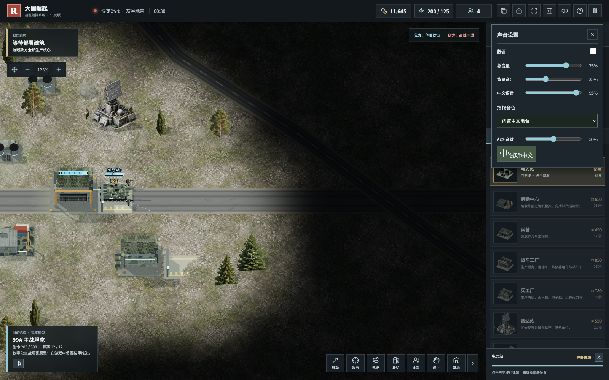

# 大国崛起：中文语音使用教程

适用版本：v0.3.0 及以上，Windows、macOS、银河麒麟、统信 UOS 等桌面浏览器。

当前本地开发版已内置中文男声、女声各 67 条离线播报，包括受袭、建筑潜入、拆弹与网络预警。v0.7.0 发布包仍为旧的 37 条男声，下载旧包不会自动得到开发版新增音色。玩家不需要安装 eSpeak、不需要下载音色或联网。内置语音为合成声音，音质偏机械，不是真人配音。

## 三步听到中文

1. 下载并解压 [最新试玩包](https://github.com/chencheng666/great-powers-rts/releases/latest)，用桌面浏览器打开 `PLAY.html`。不要只在压缩包预览窗口里打开。
2. 点击“开始作战”，进入战场。浏览器需要真实点击才能启动音频；暂停时先恢复游戏。
3. 点击顶部的扬声器图标，取消“静音”，确认“总音量”和“中文语音”都大于 0，然后点击“试听中文”。应听到“战区通信已接入。指挥官，部队等待您的命令。”

开发版声音设置中的“播报音色”可选择“内置男声电台（合成）”或“内置女声电台（合成）”，再点“试听中文”。两种声音均随游戏附带，不依赖操作系统中文音色。选“系统默认中文”仍优先使用系统语音，失败时回退内置男声；若系统有其他中文音色，也会列出其实际名称。v0.7.0 的“内置中文电台”对应旧版男声。

正常游戏中，选择部队、下达移动/攻击命令、完成建造、我方基地或单位受袭都会触发对应播报。重复警报有冷却，语音会排队，不会每次点击都马上打断前一句。

## 仍然无声时

- **所有声音都没有**：检查系统音量、浏览器标签页是否静音、系统混音器、蓝牙耳机或 HDMI 输出设备；点击扬声器按钮重新尝试启动音频。
- **配乐正常，语音没有**：检查“中文语音”滑块；恢复游戏后试听，等当前播报结束。旧版依赖系统中文音色，请升级到 v0.3.0。
- **系统中文音色存在但不出声**：系统语音未完成或出错会触发离线回退，超时检测约 12 秒；系统与浏览器的语音实现仍可能有差异。
- **本地文件被浏览器拦截**：优先换用已更新的桌面 Chromium、Chrome 或 Edge 测试。不要关闭浏览器安全策略。本项目尚未完成所有国产浏览器、CPU 架构和驱动的实机认证。
- **存档不见了**：同一目录和同一浏览器打开；跨目录或浏览器之前，先在暂停菜单“导出存档”，之后“导入存档”。这不是声音问题，但升级时容易一起遇到。

Linux 可运行包内 `启动游戏-Linux.sh`；可选的 `安装到用户菜单-Linux.sh` 会把游戏复制到用户目录并建立菜单入口，无需管理员权限，也不会安装语音引擎。

## 提交反馈

请在 [GitHub Issues](https://github.com/chencheng666/great-powers-rts/issues) 提供系统版本、CPU 架构、浏览器版本、是否有背景音乐、试听是否出声、错误截图。不要上传个人信息或与游戏无关的系统日志。

目前已在桌面 Chromium 的“无中文系统音色”环境验证离线 WAV 播放和非零音频输出。银河麒麟可玩的情况来自玩家 CAI 的反馈，此次新语音仍需国产系统实机反馈，不把浏览器测试说成全平台认证。
